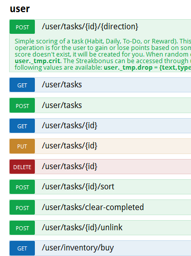
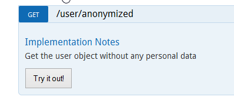
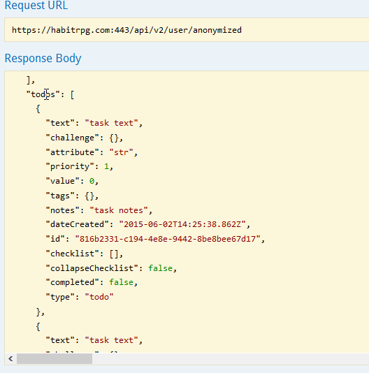

1. Open https://habitrpg.com/static/api
2. Open https://habitrpg.com/#/options/settings/api on different browser / tab

3. Copy your UUID / API Key of (2) to the Input Fields in (1)

4. Scroll down to user & click on it, now it should like 

5. Scroll more down until there is a button with "GET /user/anonymized"

6. Click on it so that it opens 

7. Click on `Try it out!`

8. Select everything of Response Body

